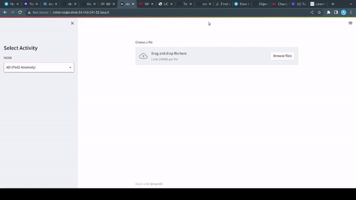

# Introduction
<p align="center">
  
<p>

- The original paper: *"Learning Memory-guided Normality for Anomaly Detection (CVPR 2020)"*. For more information, checkout the project site [[website](https://cvlab.yonsei.ac.kr/projects/MNAD/)] and the paper [[PDF](http://openaccess.thecvf.com/content_CVPR_2020/papers/Park_Learning_Memory-Guided_Normality_for_Anomaly_Detection_CVPR_2020_paper.pdf)].
- The reimplementation of the original paper: [[PDF](https://arxiv.org/abs/2101.12382)], [[repo](https://github.com/alchemi5t/MNADrc#this-is-our-reimplementation-submission-for-ml-reproducibility-challenge-2020)]
- This fork aims to add **localization** to the results as well as some **UI** to add some visualization.

## Dependencies
* Python 3.6
* PyTorch 1.1.0
* Numpy
* Sklearn
* Streamlit
* Stqdm
* Matplotlib
* OpenCV

## Datasets
* USCD Ped2 [[dataset](https://github.com/StevenLiuWen/ano_pred_cvpr2018)]
* CUHK Avenue [[dataset](https://github.com/StevenLiuWen/ano_pred_cvpr2018)]
* ShanghaiTech [[dataset](https://github.com/StevenLiuWen/ano_pred_cvpr2018)]

These datasets are from an official github of "Future Frame Prediction for Anomaly Detection - A New Baseline (CVPR 2018)".
Download the datasets into ``dataset`` folder, like ``./dataset/ped2/``

## Training and Testing
Refer to the reimplementation repo README file for details regarding training and testing. This fork only focuses on localization and visualization.

## Pre-trained model and memory items 
- Download the reimplementation repo's pre-trained model and memory items from [[here](https://drive.google.com/file/d/11f65puuljkUa0Z4W0VtkF_2McphS02fq/view?usp=sharing)].
  - The link to the models are put here only for reference. They were trained by the authors of the reimplementation repo.
- Note that, these are from training with the UCSDPed2 dataset.

## Localization
For localizing the anomaly. Refer to the snippet below in `inference.py`
```python
def localize_anomaly(config, diff_img):
    thresh = cv2.threshold(diff_img, 
                          config.loc_thresh ,
                          255, 
                          cv2.THRESH_BINARY_INV)[1]
    cnts, hierarchy = cv2.findContours(thresh, cv2.RETR_EXTERNAL, cv2.CHAIN_APPROX_SIMPLE)
    box_list=[]                                        
    loc_coords = 0
    c = max(cnts, key = cv2.contourArea)
    x,y,w,h = cv2.boundingRect(c)
    return x, y, w, h
```

## Visualization
A streamlit UI is also added to provide a visual for the reconstruction and localization.
The steps to follow are:
- Clone this fork.
- Download the pretrained models (or your own trained model).
- Download the UCSDPed2 dataset (or your own dataset).
- The UI takes input a video. The UCSDPed2 dataset does **NOT** contain videos, but video frames.
- Convert the video frames to video using ffmpeg. 
  - Note that the UCSDPed2 dataset has a folder structure like:
    ```bash
    UCSDPed2_testing/
      ├── 01
      ├── 02
      ├── 03
    ```
  - Take any video folder and merge its frames into a video using the commands below:
    ```bash
    cd 03/
    ffmpeg -framerate 12 -pattern_type glob -i '*.jpg' -c:v libx264 -pix_fmt yuv444p -crf 0 ../03.mp4
    ```
- Edit the **Config** class in `vis_prediction.py` and fill in the appropriate paths and values for the variables. 
- The UI can be fired up locally like any other streamlit UI, but if your machine doesn't have a GPU,
  you can use the colab notebook `MNADrc.ipynb` to start the UI. You will need an ngrok auth token for it. For details, you can refer this [[tutorial](https://medium.com/@jcharistech/how-to-run-streamlit-apps-from-colab-29b969a1bdfc)], or just follow the colab notebook (Refer to the **UI Stuff** section).
- The UI allows to run the anomaly detection model on an uploaded video and show the prediction video (with the anomaly localized) as well as the difference video and the regularity score graph.
  - Currently, only the anomaly with the *maximum* area is localized. If all anomalies need to be localized, the localization code needs to be modified.


## Bibtex
```
@inproceedings{park2020learning,
  title={Learning Memory-guided Normality for Anomaly Detection},
  author={Park, Hyunjong and Noh, Jongyoun and Ham, Bumsub},
  booktitle={Proceedings of the IEEE/CVF Conference on Computer Vision and Pattern Recognition},
  pages={14372--14381},
  year={2020}
}

@article{DBLP:journals/corr/abs-2101-12382,
  author    = {Kevin Stephen and
               Varun Menon},
  title     = {Re Learning Memory Guided Normality for Anomaly Detection},
  journal   = {CoRR},
  volume    = {abs/2101.12382},
  year      = {2021},
  url       = {https://arxiv.org/abs/2101.12382},
  eprinttype = {arXiv},
  eprint    = {2101.12382},
  timestamp = {Tue, 02 Feb 2021 09:52:17 +0100},
  biburl    = {https://dblp.org/rec/journals/corr/abs-2101-12382.bib},
  bibsource = {dblp computer science bibliography, https://dblp.org}
}
```
